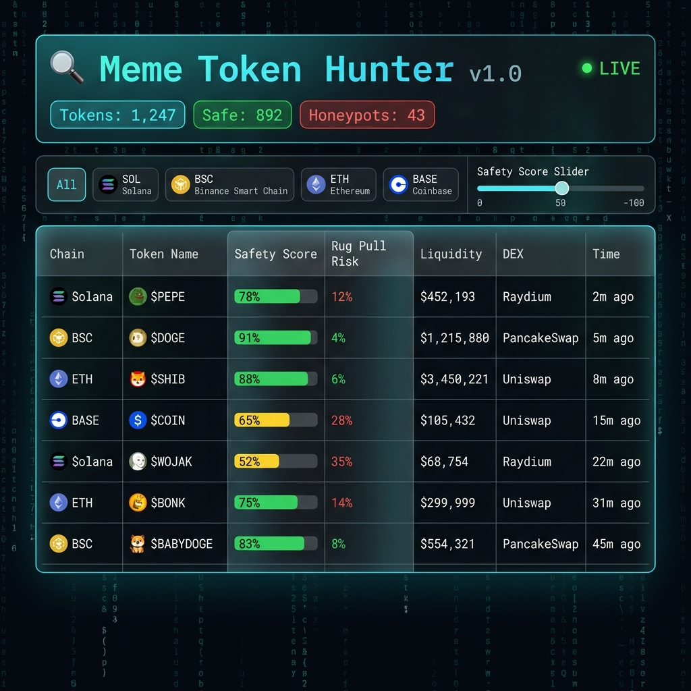
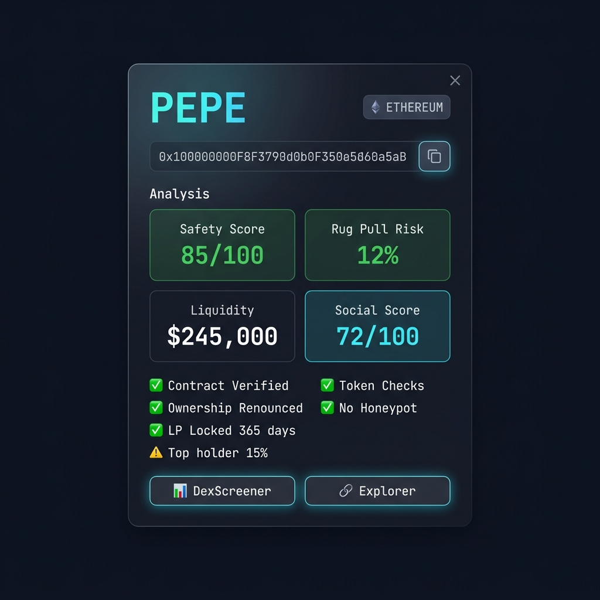
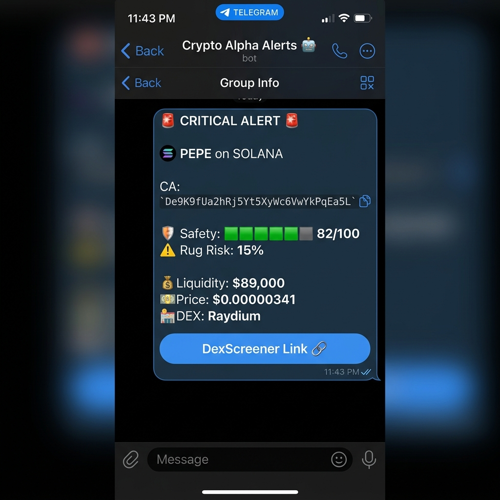

# 🔍 Meme Token Hunter

<div align="center">

**Fully automatic multi-chain meme token scanner with AI-powered rug pull detection.**

[](https://www.python.org/downloads/)
[](LICENSE)
[](https://fastapi.tiangolo.com)


*Scan 4 blockchains simultaneously • Detect honeypots in real-time • AI-powered rug pull prediction*

</div>

---

## 📸 Screenshots

### Live Dashboard — Real-Time Token Feed
<div align="center">

</div>

> Terminal-style dark theme dashboard with matrix rain background. Live WebSocket feed showing newly discovered tokens across Solana, BSC, Ethereum, and Base — with color-coded safety scores, rug pull risk percentages, liquidity data, and DEX information. Filter by chain, safety score, or time range.

### Token Detail — Deep Analysis View
<div align="center">

</div>

> Click any token for detailed analysis: 5-point safety checks (contract verification, ownership status, LP lock, honeypot test, holder distribution), rug pull risk score, social sentiment, and direct links to DexScreener and block explorers.

### Telegram Alerts — Real-Time Notifications
<div align="center">

</div>

> Instant Telegram alerts with rich formatting: safety score bars, rug pull risk indicators, liquidity data, and one-click DexScreener links. Five alert levels from 🚨 CRITICAL (potential gems) to ℹ️ INFO.

---

## 🏗 Architecture

```
┌─────────────────────────────────────────────────────────────┐
│                  Meme Token Hunter Engine                    │
├──────────┬──────────┬──────────┬──────────┬─────────────────┤
│  Solana  │   BSC    │ Ethereum │   Base   │  Scanner Layer  │
│ Raydium  │PancakeSwp│ Uniswap  │Aerodrome │                 │
│ Orca     │BakerySwap│  V2/V3   │ BaseSwap │                 │
├──────────┴──────────┴──────────┴──────────┤                 │
│            Analysis Pipeline              │                 │
│  ┌─────────┐ ┌──────────┐ ┌───────────┐  │                 │
│  │Contract │ │ Honeypot │ │  Rug Pull │  │                 │
│  │Analyzer │ │ Detector │ │ AI Predict│  │                 │
│  └─────────┘ └──────────┘ └───────────┘  │                 │
│  ┌─────────┐ ┌──────────┐                │                 │
│  │ Social  │ │  Whale   │                │                 │
│  │Analyzer │ │ Analyzer │                │                 │
│  └─────────┘ └──────────┘                │                 │
├──────────────────────────────────────────┤                 │
│           Alert System                   │                 │
│  Telegram │ Discord │ REST API           │                 │
├──────────────────────────────────────────┤                 │
│  FastAPI + WebSocket │ SQLite │ AI Model │                 │
└─────────────────────────────────────────────────────────────┘
```

## ✨ Features

| Feature | Description |
|---------|-------------|
| 🔗 **Multi-Chain Scanning** | Solana, BSC, Ethereum, Base — simultaneous real-time monitoring |
| 🛡 **5-Point Safety Check** | Contract verification, ownership, LP lock, honeypot, holder distribution |
| 🧠 **AI Rug Pull Detection** | ML model with CDN download, SHA256 verification, auto-rotation |
| 📊 **Social Sentiment** | Twitter/X, Telegram, DexScreener activity tracking |
| 🐳 **Whale Analysis** | Top holder behavior tracking and concentration alerts |
| 📱 **Telegram & Discord** | Real-time alerts with rich formatting and rate limiting |
| 🖥 **Live Dashboard** | WebSocket-powered terminal-style dark theme UI |
| 🔌 **REST API** | FastAPI with OpenAPI docs, API key auth, rate limiting |
| 💾 **Zero Dependencies** | Self-contained — SQLite database, no external services needed |

## 🚀 Quick Start

```bash
# 1. Clone the project
git clone https://github.com/AiMemeHunter/meme-token-hunter.git
cd meme-token-hunter

# 2. Install dependencies
pip install -r requirements.txt

# 3. Configure
cp .env.example .env
# Edit .env with your RPC URLs and API keys

# 4. Run
python main.py
```

**That's it!** Open http://localhost:8000 for the dashboard, http://localhost:8000/docs for the API.

> **Note:** The bot works without any API keys — it will use public RPC endpoints and run in heuristic mode (no AI model). Add your keys for full functionality.

## 📡 Supported DEXes

| Chain | DEXes | Detection |
|-------|-------|-----------|
| **Solana** | Raydium, Orca, Jupiter | New pool initialization monitoring |
| **BSC** | PancakeSwap, BakerySwap | PairCreated event scanning |
| **Ethereum** | Uniswap V2, Uniswap V3 | Factory event log monitoring |
| **Base** | Aerodrome, BaseSwap | PairCreated event scanning |

## 🛡 Safety Analysis

Each token goes through a **5-point safety check** (each worth 20 points, max 100):

| Check | What It Does |
|-------|-------------|
| ✅ **Contract Verification** | Checks if source code is verified on block explorer |
| ✅ **Ownership Renounced** | Verifies owner address is set to burn address |
| ✅ **LP Lock** | Checks liquidity lock duration and percentage |
| ✅ **Honeypot Test** | Simulates buy/sell to detect token scams |
| ✅ **Holder Distribution** | Analyzes top holder concentration risk |

## 🧠 AI Model System

- Downloads `.dat` model files from CDN with **SHA256 hash verification**
- Automatic **model rotation every 24h** based on performance
- A/B testing support for multiple model versions
- **Falls back to heuristic scoring** if no model available — bot always works!

## 📱 Alert Levels

| Level | Criteria | Action |
|-------|----------|--------|
| 🚨 **CRITICAL** | Safety ≥80, rug risk <20% | Potential early gem! |
| 🔥 **HIGH** | Safety ≥60, decent metrics | Worth investigating |
| ⚠️ **MEDIUM** | Safety ≥40 | Proceed with caution |
| 📊 **LOW** | Suspicious patterns / honeypot | Avoid |
| ℹ️ **INFO** | Informational | For tracking |

Rate limit: **50 alerts/hour** to avoid noise.

## 🔌 API Endpoints

```bash
# List recent tokens
curl http://localhost:8000/api/v1/tokens/?chain=solana&min_safety=60

# Get token details
curl http://localhost:8000/api/v1/tokens/TOKEN_ADDRESS

# Get alerts
curl http://localhost:8000/api/v1/alerts/?level=critical

# Get stats
curl http://localhost:8000/api/v1/stats/

# Health check
curl http://localhost:8000/health

# WebSocket live feed
wscat -c ws://localhost:8000/ws/feed
```

Full interactive docs at http://localhost:8000/docs (Swagger UI).

## 🛠 Configuration

All configuration via environment variables (see `.env.example`):

| Variable | Description | Required |
|----------|-------------|----------|
| `SOLANA_RPC_URL` | Solana RPC endpoint | No (uses public) |
| `BSC_RPC_URL` | BSC RPC endpoint | No (uses public) |
| `ETH_RPC_URL` | Ethereum RPC endpoint | No (uses public) |
| `BASE_RPC_URL` | Base RPC endpoint | No (uses public) |
| `MODEL_CDN` | AI model CDN URL | No (uses heuristic) |
| `TELEGRAM_BOT_TOKEN` | Telegram bot token | No (disables alerts) |
| `DISCORD_WEBHOOK_URL` | Discord webhook URL | No (disables alerts) |
| `API_KEY` | API authentication key | No (disables auth) |

## 📋 Scripts

```bash
python main.py                          # Start the bot
python scripts/init_db.py               # Initialize database
python scripts/export_signals.py 24     # Export last 24h to CSV
```

## 📁 Project Structure

```
meme-token-hunter/
├── main.py                     # ← Start here
├── hunter/
│   ├── engine.py               # Main scanning engine
│   ├── config.py               # Environment configuration
│   ├── logger.py               # Structured JSON logging
│   ├── scanners/               # Multi-chain scanners
│   │   ├── solana_scanner.py   # Raydium, Orca, Jupiter
│   │   ├── bsc_scanner.py      # PancakeSwap, BakerySwap
│   │   ├── ethereum_scanner.py # Uniswap V2/V3
│   │   └── base_chain_scanner.py # Aerodrome, BaseSwap
│   ├── analyzers/              # Safety analysis modules
│   │   ├── contract_analyzer.py
│   │   ├── honeypot_detector.py
│   │   ├── rugpull_predictor.py
│   │   ├── social_analyzer.py
│   │   └── whale_analyzer.py
│   ├── models/                 # AI model management
│   │   ├── model_manager.py    # Download, verify, load
│   │   └── model_cache.py      # Local model caching
│   ├── alerts/                 # Notification system
│   │   ├── telegram_alert.py
│   │   ├── discord_alert.py
│   │   └── alert_formatter.py
│   └── database/               # SQLite ORM
│       ├── models.py
│       └── repository.py
├── api/                        # FastAPI REST API
│   ├── server.py
│   ├── middleware.py
│   └── routes/
├── web/                        # Real-time dashboard
│   ├── index.html
│   ├── app.js
│   └── style.css
├── scripts/                    # Utility scripts
├── tests/                      # Unit tests
├── data/                       # SQLite DB (auto-created)
├── requirements.txt
└── .env.example
```

## 🧪 Testing

```bash
pip install pytest pytest-asyncio
pytest tests/ -v
```

## 📜 License

MIT License — see [LICENSE](LICENSE) for details.

---

<div align="center">

**Built for the degen community** 🚀

*Not financial advice. DYOR. The bot detects patterns — you make the decisions.*

</div>
